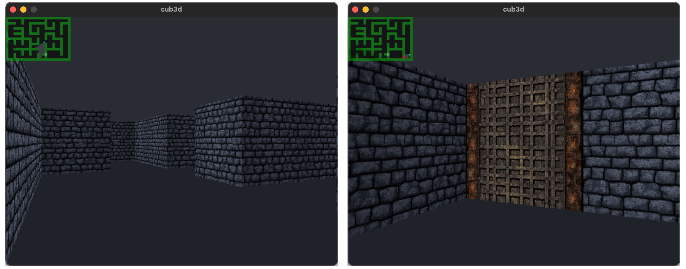

## Team Pakchoi 🥬

- [PCHANUL](https://github.com/PCHANUL)
- [srngch](https://github.com/srngch)

[](https://42seoul.kr/)
[![result](https://img.shields.io/badge/Success-100/100-5cb85c?style=flat-square&logoWidth=12&logo=data:image/png;base64,iVBORw0KGgoAAAANSUhEUgAAADAAAAAwCAYAAABXAvmHAAAAAXNSR0IArs4c6QAAAylJREFUaEPtmDmLVEEUhb+LK+IG7qIibuCKYCYYOSoGomjimoggOgiKmYGhgYEMGqgYiJmIG4ig4IKGitsv8Ae4m7ocuWO108u8flWvu+030JXN9Kmqc+49devWM0b4sBHOn56Abmewl4FeBnIiIGk6cBtYCxwzs2vVU0ptIUkzgEfAmkBawFEzu1QRUVoBgfxjYHVdklzEETO77P8vpYAm5CtafgMH3U6lEyBpJuCRX5VzPH4BB0olIJB/AqyMrG4fSiNA0izAya+IJO+wp6UQkGCbam3vgL6uCyhgGxfxl7zZx64KCLbxAxvr+RryXS2jBT3/L/JdvcjaRX7YDEhaBJwB3gOnzexHQlXIhUqa69UDWJYLHgK8DZ7/VD+n5gxIWgfcB7yk+bgF7DaznwmbZUIlzQ6XVEqpbLDNsM2cpI2h65tcx+AmsKdVEYG81/nlCcHwyG/yapM1ZzADkvYBV4ExGcAbwF4z8+s7eUiaF2yzJGFypm1qMiCpH7gQ0di5wENm5o1U9ChI/k3w/Oe8jUzSd2BSHjD8fgU4bGbe0uYOSfND5BfngocA0eR9igu4C2xP2OAi0J8nQtKC0NukkH8dPJ8b+QpfFzABeABsSBBxHjieJaJg5KM8X8+xcoinhPLmZTR2DJjZiXpwwcgXIj9ooQqB8Hh+ltjOnjOzk1VruG38kvLLMHYUJl8jwP8It+RzIMW3Z4FTYc5DYGEsc+BV8PyXhDk10IZuVJITcBFeQWLH11DJRsVOaAf5hgxUWWEp4Haak0AoBeql0m/Yht4mZZFMAcFO/jnD/TwtddEcfFKdz9u76YNGkn8NcxFT8xaK/L2t5JtmoMpO6wE/nBMjSWbB2k4+SkCwUx9wDxhfUETyDRu7T/SbWNI2wFvrsbGLB9xLYLOZeaVq+4gWEDKxFbgDjItk0rHIV/ZPEhBE7AD8fZD1dqis/QLY0qnIFxYQROwErjcR0fHItyQgR8R/Ix9dhbL8LmlXyMTogPHexg9sdD8feZYyYclnoH4lSW6ngfC5b7+ZfWuVVMr8lgWkbNYJbE9AJ6KasmYvAynR6gR2xGfgD5kpEElZbxKNAAAAAElFTkSuQmCC)](https://projects.intra.42.fr/42cursus-minishell/sarchoi)  
[](https://github.com/team-pakchoi/cub3d)
[](https://github.com/team-pakchoi/cub3d)

  


# cub3d

Ray-casting with C  
This project is inspired by the world-famous eponymous 90's game, which was the first FPS ever. It will enable you to explore ray-casting. Your goal will be to make a dynamic view inside a maze, in which you'll have to find your way.  


## Implementations

- Parse a map file
    - Check if the map is surrounded by walls with a [Flood fill algorithm](https://en.wikipedia.org/wiki/Flood_fill)
- Draw walls with a Ray-casting
    - [Ray Casting](https://www.notion.so/Ray-Casting-859473b9a6794249965543b59f2dd16c)
    - [DDA (Digital Differential Analysis)](https://www.notion.so/DDA-Digital-Differential-Analysis-9f4e63d6d2964823b7e5d4fb29a59d45)
- Draw a minimap with a Bresenham’s line algorithm
- Input keys to move player(MiniLibX and [Window System](https://en.wikipedia.org/wiki/X_Window_System))


## Project Structure

```bash
.
├── includes    # header files
├── libs        # librares
├── src         # source code
├── src_bonus   # source code for bonus
├── maps        # example map files 
└── textures    # texture image files
```

## Environment

- MacOS 12.3.1(Monterey, Intel)

Developed and tested in this environment.

## Compile

### Mandatory

To compile the mandatory version, run the lines below.

```
$ git clone https://github.com/42pakchoi/cub3d
$ make
```

### Bonus

To compile the bonus version, run the lines below.

```
$ make bonus
```

## Execute

Run compiled executable file in the root folder.

```
$ ./cub3d [map_filename]

# example
$ ./cub3d maps/map.cub
```

### Controls

- Mandatory
    - `ESC` to exit a game. You can also use close button at a window frame.
    - `WASD` to move
    - `Left arrow` and `Right arrow` key to rotate
- Bonus
    - spacebar to open and close a door
    - mouse drag in window to rotate

## Test

Test using files in `maps` directory. Files marked with 'error_' are files that assume an exception condition. 

```bash
$ ./cub3d [error_filepath]

# example
$ ./cub3d maps/error_invalid_char.cub # Failed to parse map
$ ./cub3d maps/error_invalid_extension.txt # Invalid file extension.
```

